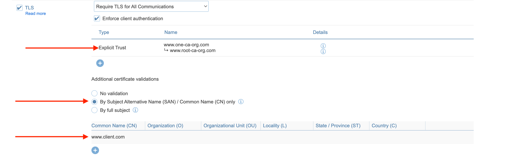

### Root CA
First off, we need a private key:
```
openssl genpkey -algorithm RSA -out root_ca.key
```

Now we need a certificate that will be signed by the private :
Our certificate configuration saved in a file named root_ca.cnf:

```
# root_ca.cnf

[req]
default_bits = 2048
prompt = no
default_md = sha256
distinguished_name = dn

[dn]
C = IL
ST = Tel-Aviv
L = Locality
O = RootCAOrg
OU = Security
CN = www.root-ca-org.com

[req_ext]
basicConstraints = critical, CA:TRUE

```

```
openssl req -x509 -new -nodes -key root_ca.key -sha256 -days 3650 -out root_ca.crt -config root_ca.cnf -extensions req_ext
openssl x509 -in root_ca.crt -text
```

### Intermediate CA

First we need to create a certificate signing request using our intermediate key and intermediate configuration:

```
# intermediate_1_ca.cnf

[req]
default_bits = 2048
prompt = no
default_md = sha256
distinguished_name = dn

[dn]
C = IL
ST = Tel-Aviv
L = Tel-Aviv
O = OneCAOrg
OU = Security
CN = www.one-ca-org.com

[req_ext]
basicConstraints = critical, CA:TRUE
```

Generating the intermediate private key:
```
openssl genpkey -algorithm RSA -out intermediate_1_ca.key
```

Now let’s generate the intermediate certificate:

```
openssl req -new -key intermediate_1_ca.key -out intermediate_1_ca.csr -config intermediate_1_ca.cnf
openssl x509 -req -in intermediate_1_ca.csr -CA root_ca.crt -CAkey root_ca.key -CAcreateserial -out intermediate_1_ca.crt -days 1825 -sha256 -extfile intermediate_1_ca.cnf -extensions req_ext
openssl x509 -in intermediate_1_ca.crt -text
```

Create the certificate chain:

```
cat intermediate_1_ca.crt  root_ca.crt > ca_chain.crt
```

### Leaf client certificate:

```
# client.cnf

[req]
default_bits = 2048
prompt = no
default_md = sha256
distinguished_name = dn

[dn]
C = FR
ST = Paris
L = Paris
O = Operations
OU = Operations
CN = www.client.com

[req_ext]
basicConstraints = CA:FALSE
keyUsage = nonRepudiation, digitalSignature, keyEncipherment
extendedKeyUsage = clientAuth
```

Generate the client key:
```
openssl genpkey -algorithm RSA -out client.key
```
Generate the client.csr file using the client key and client.cnf file:
```
openssl req -new -key client.key -out client.csr -config client.cnf
```
Generate the client.crt file, using the intermediate CA certificate, the intermediate CA key, the client.cnf file and the client.csr:
```
openssl x509 -req -in client.csr -CA intermediate_1_ca.crt -CAkey intermediate_1_ca.key -CAcreateserial -out client.crt -days 1825 -sha256 -extfile client.cnf -extensions req_ext
```
Finally, create a client certificate chain:
```
cat client.crt intermediate_1_ca.crt root_ca.crt > client_chain.crt
```

### Set up the Redis database with ca_chain.crt



1) add the ca_chain.crt 

