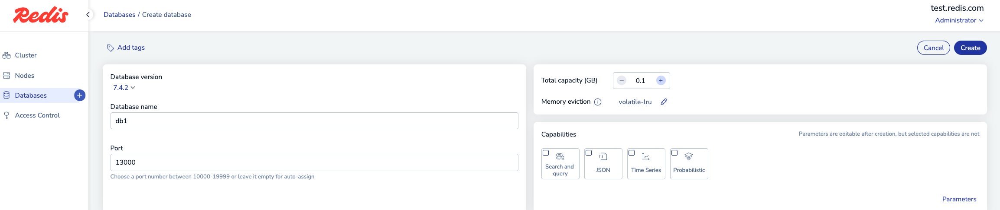
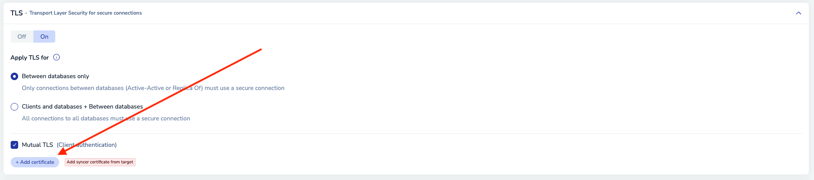
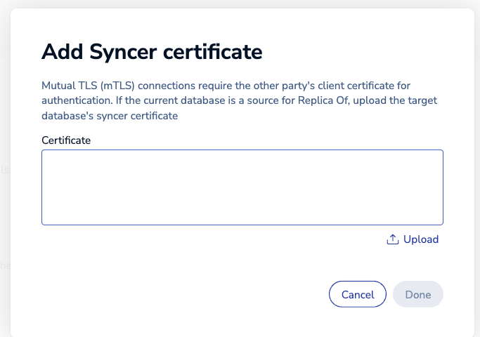
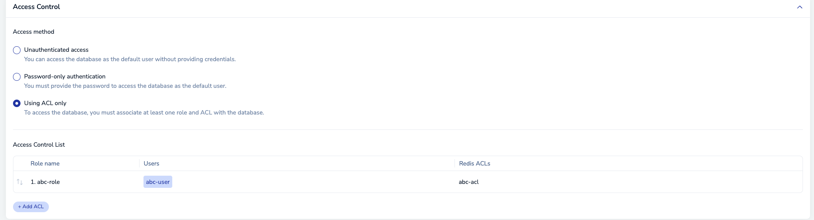

### setup the env for cluser username and password
```
export USERNAME=admin@redis.com
export PASSWORD=1234
```

### Create an ACL (abc-acl) which is restricted to keys starts with abc prefix
```
curl -k -u "$USERNAME:$PASSWORD" -X POST \
-H "Content-Type: application/json" \
-d '{ "name": "abc-acl", "acl": "~abc +@all" }' \
https://localhost:9443/v1/redis_acls
```
#### Output
```
{"acl":"~abc +@all","max_version":"9999","min_version":"6.0","name":"abc","uid":2}
```


### Create a role
```
curl -k -u "$USERNAME:$PASSWORD" -X POST \
-H "Content-Type: application/json" \
-d '{"management":"none","name":"abc-role" }' \
https://localhost:9443/v1/roles

```

#### Output
```
{"management":"none","name":"abc-role","uid":2}
```

### Create user (abc-usr). Assign the role to abc-role by (role_uids = 2 )
```
read -r -d '' payload <<EOF
{
    "auth_method": "certificate",
    "certificate_subject_line": "C=US,CN=abc",
    "name": "abc-user",
    "role_uids": [
      2
    ]
}
EOF

curl -k -u "$USERNAME:$PASSWORD" -X POST \
-H "Content-Type: application/json" \
-d "$payload" \
https://localhost:9443/v1/users
```

#### Output
```
{"action_uid":"5bb5c0c6-68d6-4e3e-8eb7-606442b12aee","auth_method":"certificate","certificate_subject_line":"C=US,CN=abc","email":"","email_alerts":true,"name":"abc-user","role":"none","role_uids":[2],"status":"active","uid":2}
```

### Setup the database
#### Name and port


#### TLS and mTLS


#### add Cert chian from  abc_ca_chain.crt


#### add role, user and acl


